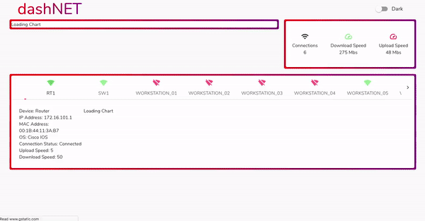

[See the Dashboard in action](https://networkdashboard.netlify.app/)

[Back-end Repo](https://github.com/LUKERHYS/Simulated-Network-Monitor)

This project was built as our final project for CodeClan's professional software development course. Version 1 was completed in the first 5 day sprint, we then continued to develop the project after the course finished. It functions as a Networking panel, and is also available for use as a websocket API with updating network data.

Our aim for this project was to model a useful tool. We wanted to build a web app dashboard that would display network data and monitor changes for connected devices. The dashboard would need to display vital stats and enable data to be understood at a glance.

The gif below shows a quickened version of the dashboard updating with new network data. It starts with 10 timestamps for each device, adds 60 more, and resets to 10. In the live version this repeats every hour.



The initial plan was to use an existing API to generate the network data, we would then build our own API to store and access changes over time for each device giving us the ability to graph those changes in state. After some research we realised that such an API did not exist and that we would need to build it. This lead to the creation of the second back-end to simulate a network.
​
## Project Overview

### Stack
- Python (Flask, SQLAlchemy, Marshmallow, Websockets/Asyncio)
- ReactJS
- HTML/CSS
- Docker/Docker Compose

### Structure

The project consists of three main components: the network server, the app server, and the dashboard. In addition there is a cron-job container which is used to initiate the processes of updating the network data.

[Diagram showing network-app-cron-dashboard + databases and interactions]

#### Network server
The network server stores and presents the static data of each network device via a RESTful API built using Flask. It is not directly accessible in the live version but is used to provide data to the app server. 

It has a POST route for adding multiple devices, via port 5000 when runnning locally. This route can be used on the server for adding new devices. 

It also has a GET route which updates all device dynamic data and returns all device data as JSON. This allows the network server to mimic a somewhat real changeable network with dynamically generated values.

Example data from the network server, showing the current state of the network:

```javascript
[
    {
        "device_type": "Router",
        "id": 1,
        "ip_address": "172.16.101.1",
        "operating_system": "Cisco IOS",
        "host_name": "RT1",
        "mac_address": "00:1B:44:11:3A:B7",
        "download_speed": 12,
        "upload_speed": 9,
        "active_connection": true
    },
    {
        "device_type": "Switch",
        "id": 2,
        "ip_address": "172.16.101.2",
        "operating_system": "Cisco IOS",
        "host_name": "SW1",
        "mac_address": "00:1B:44:11:5R:B8",
        "download_speed": 38,
        "upload_speed": 12,
        "active_connection": true
    }
]
```
​
####App server
 
The app server acts as the middle man between the network server and the dashboard. It requests data from the back end and splits the static data (host\_name, device\_type, ...) from the dynamic data (upload\_speed, download\_speed, active\_connection). A time stamp is added to the dynamic data so that the network changes can be tracked and plotted over time. This formatted JSON data is then presented to the front-end via a websocket.

Two cron-jobs trigger different behaviours in the app-server:

**Refresh:** The app server makes a fetch request to the network server for the current network data, before storing as static and dynamic data. Occurs every minute from 01-59.

**Clean:** The app server clears the database and requests a new baseline of 10 datapoints. Occurs every hour at minute 00. This keeps the demo data for the dashboard easy to view.

Example data from the app server, showing multiple snapshots:

```javascript
[
    {
    	"id": 1,
        "mac_address": "00:1B:44:11:3A:B7",
        "ip_address": "172.16.101.1",
        "device_type": "Router",
        "host_name": "RT1",
        "operating_system": "Cisco IOS",
        "snap_shots": [
            {
                "upload_speed": 4,
                "active_connection": true,
                "id": 1,
                "download_speed": 66,
                "time_stamp": "2020-04-30 11:18:50.035494"
            },
            {
                "upload_speed": 0,
                "active_connection": true,
                "id": 13,
                "download_speed": 58,
                "time_stamp": "2020-04-30 11:19:03.387041"
            }
        ]
    },
    {
    	"id": 2,
        "mac_address": "00:1B:44:11:5R:B8",
        "ip_address": "172.16.101.2",
        "device_type": "Switch",
        "host_name": "SW1",
        "operating_system": "Cisco IOS",
        "snap_shots": [
            {
                "upload_speed": 0,
                "active_connection": false,
                "id": 2,
                "download_speed": 0,
                "time_stamp": "2020-04-30 11:18:50.304669"
            },
            {
                "upload_speed": 0,
                "active_connection": false,
                "id": 14,
                "download_speed": 0,
                "time_stamp": "2020-04-30 11:19:03.404504"
            }
        ]
    }
]
```

#### Network Dashboard
The network dashboard is a React web app which connects to the app server via a websocket. It updates its state whenever it recieves new data from the app server.

It displays the individual device data and network summary data as it varies over time.

## Local set-up

Once you've cloned the repo you'll need to install the packages:

```
npm install
```

Then start the app:

```
npm start
```
This should open [http://localhost:3000](http://localhost:3000) in your default browser.

## Functionality

### Fetching data in Real Time

Initially, we used a standard http fetch request to get our data. 

```javascript
componentDidMount() {
	const url = 'http://localhost:5001/presentation-data';
​
    fetch(url)
    	.then(res => res.json())
      	.then(devices => this.setState({
         devices: devices 
       }))
      	.catch(err => console.error); 
}
```
	
However, one of our goals was to render these connections in real-time, so that we can show whether or not a device is connected in real time.  In order to achieve this we utilised a websocket, replacing the http fetch.

```javascript	
ws = new WebSocket(URL)  
​
componentDidMount() {
 	this.ws.onopen = () => {console.log('connected')}
​
​	this.ws.onmessage = evt => {
		let deviceData = JSON.parse(evt.data)
		this.setState({devices: deviceData})
	}

	this.ws.onclose = () => {
  		console.log('disconnected')
   		this.setState({ws: new WebSocket(URL)})
}
```
 
Now when the websocket recieves an update from the app server it immediately updates the state. However, we encounter a problem if the React app is loaded before the app server: the React app closes it's websocket and has no way to reopen when the app server is running. 
​
In order to prevent this we refactor the componentDidMount to call a function which connects the websocket. This allows the websocket connection to be established elsewhere if it fails in the mount phase.	

```javascript
componentDidMount() {
	this.connectToWebSocket();
}
```

The function connectToWebSocket() establishes the websocket in the state, and adds a timeout interval. If the websocket is unable to connect, or closes early the function checkForWebSocket() will be called every 30s to attempt to reconnect.

```javascript
connectToWebSocket() {
	let ws = new WebSocket(URL);
	let connectInterval;
​
	ws.onopen = () => {
  		console.log("Connected to Websocket")
​
  		this.setState({ ws: ws})
  		clearTimeout(connectInterval)
	}
​
	ws.onmessage = evt => {
	  	let deviceData = JSON.parse(evt.data)
	  	this.setState({devices: deviceData}) 
	  	this.chartDataMapping()
	    
	  	this.countConnectedDevices()
	  	this.countUploadSpeed()
	  	this.countDownloadSpeed()
	}
	
	ws.onclose = e => {
		console.log(`Socket is closed. Reconnect will be attempted in 30 seconds.`, e.reason)
  
  		connectInterval = setTimeout(() => {
    		this.checkForWebSocket()
  		}, 30000)
	}
}
```
The function below will attempt to connect to the app server websocket if it is not already connected. This will then update the websocket state as above and be able to recieve data. This is effectively causing an infinite loop, that only ends when the websocket is open again, or the app is closed.

```javascript
checkForWebSocket() {
	if (!this.ws || this.ws.readyState === WebSocket.CLOSED) {
  		this.connectToWebSocket()
    }
 }  
```

## Version history

1.0.0 App & Network servers: HTTP APIs

2.0.0 App server: websocket API | Network server: HTTP API

2.0.1 App server: password protected websocket API | Network server: HTTP API


